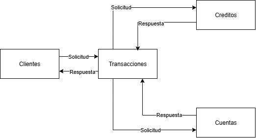
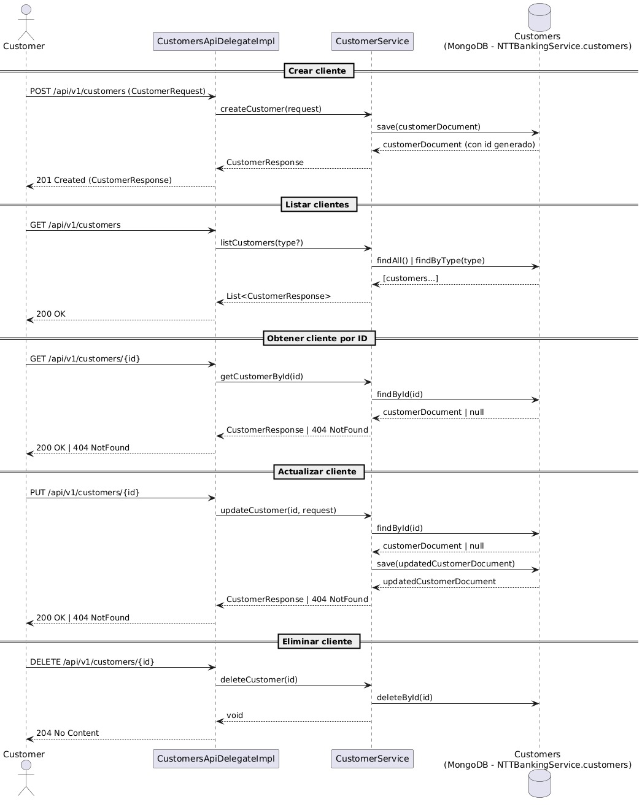

# Customers Service - NTT Data Bootcamp (Avance 2)

Microservicio bancario desarrollado en el **Bootcamp de Microservicios**.  
Este repositorio corresponde al **Avance 2 del proyecto**, donde se amplía el microservicio de clientes con pruebas, métricas de calidad y validaciones adicionales.

---

## Alcance del Avance 2

En esta entrega se agregan y consolidan los siguientes requerimientos:

- ✅ CRUD completo de clientes (Create, Read, Update, Delete) con validaciones de negocio:
  - `documentNumber` obligatorio y único por cliente activo
  - Segmento por defecto **STANDARD**
  - Restricciones:
    - Solo **PERSONAL** puede ser **VIP**
    - Solo **BUSINESS** puede ser **PYME**
- ✅ Endpoints REST contract-first basados en **OpenAPI 3.0**
- ✅ Integración con **Spring Cloud Config Server**
- ✅ Uso de **Spring WebFlux** y repositorio reactivo con **MongoDB**
- ✅ Generación de DTOs y mapeo entre modelos con **CustomerMapper**
- ✅ **Checkstyle** configurado (estilo de código estándar Google)
- ✅ **JaCoCo** configurado para métricas de cobertura de pruebas
- ✅ **Pruebas unitarias** con **JUnit 5**, **Mockito** y **Reactor Test**:
  - Tests para **Service**
  - Tests para **Controller**
  - Tests para **Mapper** y **Domain**

---

## Tecnologías utilizadas

- Java 11
- Spring Boot 2.7.x
- Spring WebFlux
- Spring Data MongoDB (reactivo)
- Spring Cloud Config
- OpenAPI 3.0 / Swagger
- Lombok
- Logback
- JUnit 5
- Mockito
- Reactor Test
- Checkstyle
- JaCoCo

## Diagramas UML 

### Diagrama UML arquitectura
Muestra la interacción entre Clientes, Transacciones, Cuentas y Créditos.

  

### Diagrama de Secuencia CRUD Clientes
Muestra el flujo de llamadas entre las capas (controller, service, repository, DB) para las operaciones CRUD. 

  

